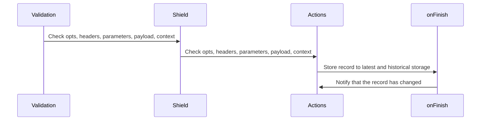

# Architecture decision records

An [architecture
decision](https://cloud.google.com/architecture/architecture-decision-records)
is a software design choice that evaluates:

-   a functional requirement (features).
-   a non-functional requirement (technologies, methodologies, libraries).

The purpose is to understand the reasons behind the current architecture, so
they can be carried-on or re-visited in the future.

## Hero image prompt

> A black and white comic book illustration of a female superhero on the Moon.
She is using her laser vision to carve the letter L on the moon surface.
Behind her, the dark sky is filled with stars and the Earth is visible. The
Moon’s surface is rough and rocky, with many craters and shadows. On the
Moon's surface, we can some natural stacks of crystals and diamonds that are
sparkling.

## Engraving workflow

* Created: May 2023

### Context and Problem Statement

> The workflow with the different phases of engraving

### Decision Drivers

* Simplicity
* Flexibility

### Decision Outcome

A semi-flexible workflow in which some steps are expected (ex: validation) while some other are more flexible (ex: action)

