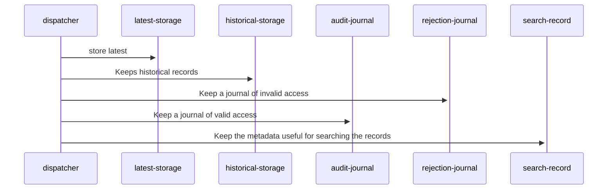

# Sequence diagram for Lunar diamond engraving event store

> Facilitate the writing of records in a cloud event store

## Lifelines

    - dispatcher: Payload dispatcher
    - latest-storage: Latest storage
    - historical-storage: Historical storage
    - audit-journal: Audit journal
    - rejection-journal: Rejection journal
    - search-record: A contenation of fields used for search purpose

## Sequence Diagram
